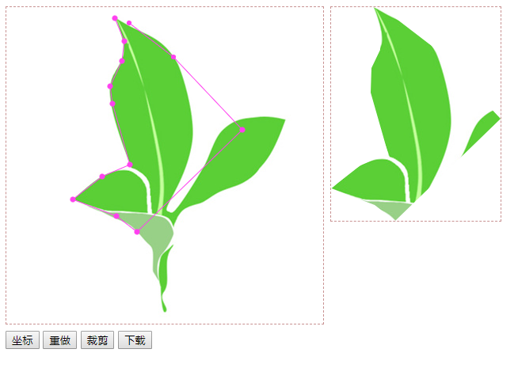

# 钢笔抠图插件
基于Html5 Canvas 实现js钢笔抠图插件.

## 背景
2014年，基于js研发一款类似PS中钢笔抠图功能的插件，核心源码以博客的形式发表： [html5 canvas+js实现ps钢笔抠图]( https://www.cnblogs.com/guozefeng/p/3719915.html) ，之后陆续有其他开发者提出一些需求和建议，比如能不能支持js前端生成抠图、图片等比抠图、自定义图片尺寸等等，我将逐渐优化该插件使之最终能成为一款功能完善、拿来即用的抠图插件。

## 兼容（ie8+、火狐、谷歌等主流浏览器）


## 合作交流
该插件仅供学习研究，未授权商用。插件商用还请联系如下，我们将提供功能齐全的商用定制化插件。
* QQ : 1624484726
* mail: 1624484726@qq.com

## 应用案例

* 帮帮铺(bbpu) www.bbpu.com

  [bbpu抠图bbpu.com](https://bbpu.com/koutu.html) 一个完成度较高的在线抠图工具，集成了该钢笔抠图插件，在此基础上集成了智能抠图、矩阵抠图、图片压缩、图片格式转换的一些功能。
  
* 商业化在线抠图服务快速接入
  
   [bbpu抠图服务开放API](https://bbpu.com/koutu/page/api.html) 目前通过提供开放链接的方式方便为商家快速接入抠图服务。

* 速写板 www.suxieban.com

  [速写板抠图](https://suxieban.com) 在线画板、在线纸和笔

  
## 使用方法
```js
//默认配置项
 this.defaults = {
        //画板容器id
        drawPanel: "drawPanel",
        //自动生成canvas标签Id
        canvasId: "canvas",
        //自动生成图片标签Id
        imgId: "imgCut",
        //画板宽度
        width: 400,
        //画板高度
        height: 400,
        //抠图图片src
        imgSrc: "file/target.jpg",
        //抠图完成填充背景图片（默认）
        imgBackSrc: "file/tranback.png",
        //钢笔色
        penColor: "#0087C4",
        //初始话钢笔抠图坐标集合
        defaultPointList: new Array(),
        showTip: function (msg) {
            alert(msg);
        }
    };


// 使用（通过init方法覆盖默认属性，并初始化事件）
  var _penCutout = new penCutout();
            _penCutout.init({
                //覆盖属性
                drawPanel: "drawPanel",
                imgSrc: "file/target.jpg",
                width: 400,
                height: 400
            });
            
            
// 支持动态修改默认项
_penCutout.iniData(options);

// 获取钢笔抠图坐标点（可以post给后端渲染）
_penCutout.can.pointList

//重做
 _penCutout.downLoad();

// 获取剪裁图片urlData(imgsrcData,生成图片的宽度，生成图片的高度)
_penCutout.createCutImg(function (imgSrcData, w, h) {})

//下载图片（兼容ie8+、火狐、谷歌等主流浏览器）
_penCutout.downLoad();
```

## 注意事项
```html
1.谷歌chrome本地打开index.html，由于安全设置，会报如下错误，解决方案：使用火狐或IE，放到服务器访问不存在如下问题。
Access to image at 'file:///D:/mywork/pen-cutout-js/static/file/target.jpg' from origin 'null' has been blocked by CORS policy: Cross origin requests are only supported for protocol schemes: http, data, chrome, chrome-extension, https.
target.jpg:1 Failed to load resource: net
```

